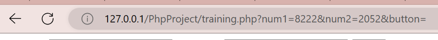
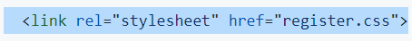
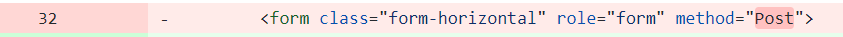
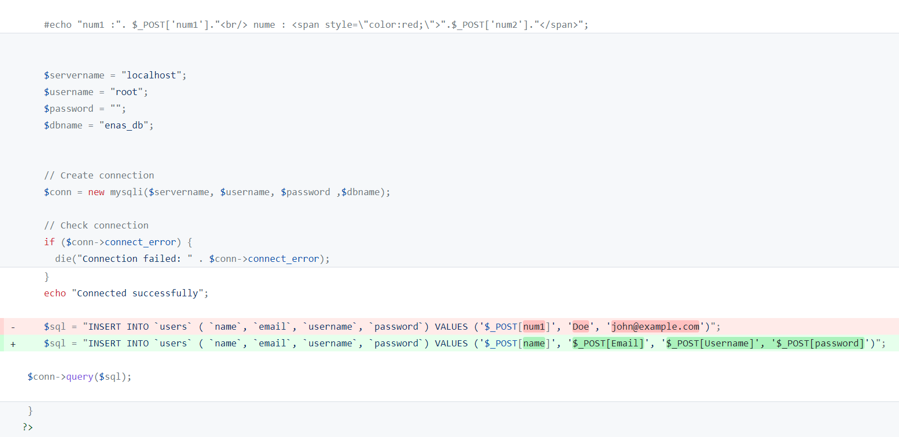

# Php-project
## isset()
- هذه الدالة وظيفتها التأكد من وجود عنصر  
- نبدأ العمل بوضع الدالة form خارج php
- يوضع العنصر المراد التأكد منه في الأقواس داخلها
- لتظر المُحتويات المُدخله في الرابط أعلى الصفحة في الأمر الأول أو لا تظهر في الأمر الثاني كما الصورة  المُرفقة تباعاً
- من المهم ترتيب الأوامر أثناء كتابة الكود حتى تتنفذ بالترتيب الصحيح
- الأمر () isset يعني أنه في حال تنفيذ الأ مر الموجود داخل الأقواس فنفذ الأمر الذي يليه

## GET  

## POST

--------------------------------------
## How I build the register?
- أخدنا الفورم منBootdey 
- فصلت ال CSS code بفايل منفصل و الربط بينهم من خلال 

بعد head مباشرة
- إضافة method="post" لتحديد طبيعة الفورم

- تعديل محتويات Input داخل الكود حسب الفورم المرغوب
- إضافة كود php و ربطه مع ال database مع اجراء التعديلات المطلوبة

--------------------
## How to build LOGIN form?

------------------------

# if else statements
- == Equal
- === Identical
- != not Equal
- <> not Equal
- !== not Identical
- <=> this sign results (-1,0,1) where if < is true then the resule = 1 , if it's = then it's = 0, and if it's > then it's = -1
- (.), (.=) لجمع البيانات النصية ويتعامل مع الأرقام على أنها نصوص

## logical operators
- and, &&
- or, ||
- xor, one of them is true but not both
- ! يوضع قبل أي جملة منطقية بحيث يقلب النتيجة, فلو كانت نتيجة الجملة الشرطية true فسيقلبها لfalse

## switch case 
بيتم اضافة احتمالات cases داخل switch و مقارنتها مع المتغير المذكور بجاني switch  و المُعرف مسبقاً بحيث أن الكيس المساوي للمتغير سيتنفذ الأمر الذي يتبعه ثم يتوقف بالأمر break ويخرج من switch 
أما إذا لم يتحقق أي من ال cases الموجودة فسينفذ ما بعر كلمة default

## difference B/N For , while loop & do While loop
- العداد يكون داخل forLoop , و خارج الwhileLoop
- يجب تحديد عدد مرات تكرار اللوب داخل ال forLoop, أما ال whileLoop تتكرر اللوب بناءً على شرط يوضع داخل الأقواس
- عملية الزيادة على العداد تكون داخل أقواس ال forLoop, و تكون داخل ال {} في ال whileLoop
- أما الdo while loop  فإن الأمر داخل  do سيتنفذ أولاً ومن ثم سيتحقق من الشرط while

### break, continue
- continue بمعنى انه استمر في تنفيذ الأممر ما عدا المرة الموجودة في الشرط, ولكن يجب أن يوضع أمر الزيادة أو النقصان في العدد قبل كلمة continue
- وجود break  يعني وقف ال loop

## Merge elements
- include //login.php line 40
- require //merge.php
- include_once في حال قمت بالدمج نفسه سابقاً فلن يتكرر
- require_once نفس ما سبق

الفرق بين العنصرين هو أنه في حال حدوث خطأ ضمن include فإنه يُظهر الخطأ دون حدوث مشاكل بباقي الكود, 

أما requir فالخطأ داخلها يتسبب بتعطل كامل الموقع

لدمج ملف(ْX) بملف آخر(Y) خارجه, ما عليك سوى كتابة جملة الدمج بالشكل التالي:

include '../register.php';

../ بمعنى خطوة للخلف, ../../بمعنى خطوتين للخلف, يعني اطلع برى ملفين